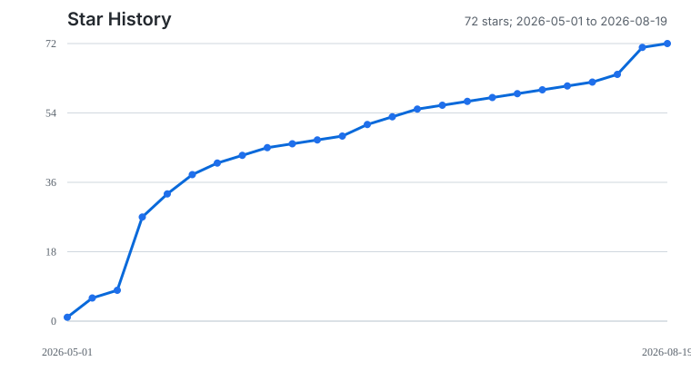

<div align="center">

# Cpp-Interviewer

**C++ 面试学习伙伴 — 学 + 练，下载后可直接交给 Agent 使用**

[中文](#中文) | [English](#english)


</div>

---

<a id="中文"></a>

## 中文

### 简介

Cpp-Interviewer 是一个面向主流 Agent 的 C++ 面试 skill 项目，提供学 + 练双模式：

- **`/interview` 直接给精炼答案**：默认简洁模式，不模拟面试、不反问，覆盖 C++、STL、操作系统、网络、数据库等高频考点。
- **`/coach` 模拟面试官追问**：出题 → 等你回答 → 六维度评价 → 记录掌握度 → 继续追问薄弱点。
- **无需 API Key**：直接使用当前 Agent 作为 LLM。
- **无需 PDF/Git LFS**：内置知识索引，clone 后即可安装使用。
- **Agent 中立**：核心 skill 可被 Codex、Claude Code、Cursor、Gemini、Copilot 等 Agent 复用。

### 让 Agent 直接安装

把下面这段发给你的本地 Agent 即可：

```text
请安装 Cpp-Interviewer：
git clone https://github.com/yiqi-7/Cpp-Interviewer.git
cd Cpp-Interviewer
python setup.py --agents all
安装后重启当前 Agent，并用 /interview 或 /coach 测试。
```

默认安装到常见 skills 目录：

| Agent | 安装目录 |
|------|----------|
| Codex / ChatGPT | `~/.codex/skills/` |
| Cursor | `~/.cursor/skills/` |
| Claude Code | `~/.claude/skills/` |
| 通用 Agent skills 目录 | `~/.agents/skills/` |

只安装到当前 Codex：

```bash
git clone https://github.com/yiqi-7/Cpp-Interviewer.git
cd Cpp-Interviewer
python setup.py
```

指定目标或自定义目录：

```bash
python setup.py --agents codex,cursor,claude
python setup.py --skills-dir /path/to/your/agent/skills
```

安装后重启对应 Agent。在支持 slash skill 的环境中输入 `/`，即可看到 `interview` 和 `coach`。不支持 slash skill 的 Agent 可以读取仓库内的 `.github/copilot-instructions.md`、`GEMINI.md`，或直接引用 `skills/cpp-interviewer/SKILL.md`。

### 两种模式

| 入口 | 模式 | 核心定位 | 示例 |
|------|------|----------|------|
| `/interview` | 知识讲解（学） | 直接给高密度答案，适合快速复习 | `/interview 虚函数是怎么实现的` |
| `/coach` | 面试训练（练） | 一次一题，追问式训练 | `/coach 虚函数`、`/coach weak` |

#### `/interview` 示例

```text
/interview 虚函数是怎么实现的
/interview 智能指针有哪几种
/interview 什么是内存泄漏
```

#### `/coach` 示例

```text
/coach 虚函数          # 专项训练
/coach weak            # 训练薄弱知识点
/coach due             # 复习到期内容
/coach status          # 查看掌握度
/coach plan            # 生成今日计划
/coach start           # 进入训练循环
```

`/coach` 会像面试官一样：**出题 → 等你回答 → 评价 → 追问 → 下一题**。

### 状态和路径

训练状态默认保存在 `~/.cpp-interviewer/coach.sqlite`。可用环境变量覆盖：

```bash
export CPP_INTERVIEWER_HOME="$HOME/.cpp-interviewer"
export CPP_INTERVIEWER_DB="$HOME/.cpp-interviewer/coach.sqlite"
export CPP_INTERVIEWER_INDEX="/path/to/knowledge_index.json"
```

Windows PowerShell：

```powershell
$env:CPP_INTERVIEWER_HOME="$HOME\.cpp-interviewer"
$env:CPP_INTERVIEWER_DB="$HOME\.cpp-interviewer\coach.sqlite"
$env:CPP_INTERVIEWER_INDEX="C:\path\to\knowledge_index.json"
```

### 开发者调试

```bash
python -m pytest -q
python -m coach.cli status
python -m coach.cli topic search 虚函数 --json
python -m coach.cli topic-context cpp_vtable --json
```

如需安装 `coach` / `cpp-coach` console script，可运行 `python setup.py develop`。

### 项目结构

```text
Cpp-Interviewer/
├── skills/
│   ├── cpp-interviewer/      # agent-neutral 核心 skill
│   │   ├── SKILL.md
│   │   ├── agents/openai.yaml
│   │   └── references/
│   ├── interview/            # /interview 兼容入口
│   └── coach/                # /coach 兼容入口 + Python 后端
├── .github/copilot-instructions.md
├── GEMINI.md
├── setup.py
└── tests/
```

### 当前限制

- `/coach reset` 和 `/coach export` 尚未实现。
- `Gemini`、`Copilot` 等 instruction-only Agent 通常不会自动注册 slash command，需要在对应工具中显式引用仓库说明或核心 `SKILL.md`。

## Star History

<a href="https://www.star-history.com/?repos=yiqi-7%2FCpp-Interviewer&type=date&legend=top-left">
 <picture>
   <source media="(prefers-color-scheme: dark)" srcset="./assets/star-history-dark.svg" />
   <source media="(prefers-color-scheme: light)" srcset="./assets/star-history-light.svg" />
   
 </picture>
</a>

### 开源许可

本项目采用 [MIT License](https://github.com/yiqi-7/Cpp-Interviewer/blob/main/LICENSE) 开源。

### 社区

- 已获 [LINUX DO](https://linux.do/) 社区认可

---

<a id="english"></a>

## English

### Introduction

Cpp-Interviewer is an agent-neutral C++ interview skill with two modes:

- **`/interview`**: concise, direct explanations for C++ and CS interview topics.
- **`/coach`**: one-question-at-a-time interview practice with six-dimension evaluation and SQLite mastery tracking.
- **No API key required**: the host agent is the LLM.
- **No PDF or Git LFS required**: it works with the built-in knowledge index after clone.
- **Portable across agents**: Codex, Claude Code, Cursor, Gemini, Copilot, and other tools can reuse the same core skill.

### Agent-Friendly Install

Give this to your local agent:

```text
Install Cpp-Interviewer:
git clone https://github.com/yiqi-7/Cpp-Interviewer.git
cd Cpp-Interviewer
python setup.py --agents all
Restart the target agent, then test /interview or /coach.
```

Install only to Codex:

```bash
git clone https://github.com/yiqi-7/Cpp-Interviewer.git
cd Cpp-Interviewer
python setup.py
```

Choose targets or a custom skills directory:

```bash
python setup.py --agents codex,cursor,claude
python setup.py --skills-dir /path/to/your/agent/skills
```

Common targets:

| Agent | Skills directory |
|-------|------------------|
| Codex / ChatGPT | `~/.codex/skills/` |
| Cursor | `~/.cursor/skills/` |
| Claude Code | `~/.claude/skills/` |
| Generic agent skills | `~/.agents/skills/` |

For instruction-only agents, use `.github/copilot-instructions.md`, `GEMINI.md`, or point the agent at `skills/cpp-interviewer/SKILL.md`.

### Usage

```text
/interview How are virtual functions implemented
/interview What types of smart pointers are there
/coach virtual_function
/coach weak
/coach status
/coach plan
```

### State

Training state defaults to `~/.cpp-interviewer/coach.sqlite`. Override paths with:

```bash
export CPP_INTERVIEWER_HOME="$HOME/.cpp-interviewer"
export CPP_INTERVIEWER_DB="$HOME/.cpp-interviewer/coach.sqlite"
export CPP_INTERVIEWER_INDEX="/path/to/knowledge_index.json"
```

### Developer Mode

```bash
python -m pytest -q
python -m coach.cli status
python -m coach.cli topic search virtual_function --json
python -m coach.cli topic-context cpp_vtable --json
```

Run `python setup.py develop` only if you want the `coach` / `cpp-coach` console scripts.

## Star History

<a href="https://www.star-history.com/?repos=yiqi-7%2FCpp-Interviewer&type=date&legend=top-left">
 <picture>
   <source media="(prefers-color-scheme: dark)" srcset="./assets/star-history-dark.svg" />
   <source media="(prefers-color-scheme: light)" srcset="./assets/star-history-light.svg" />
   
 </picture>
</a>

### License

This project is licensed under the [MIT License](https://github.com/yiqi-7/Cpp-Interviewer/blob/main/LICENSE).
